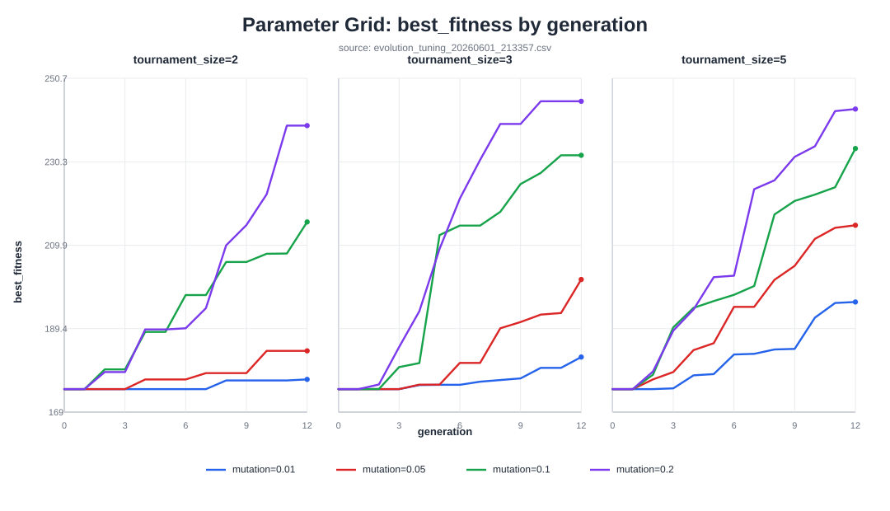
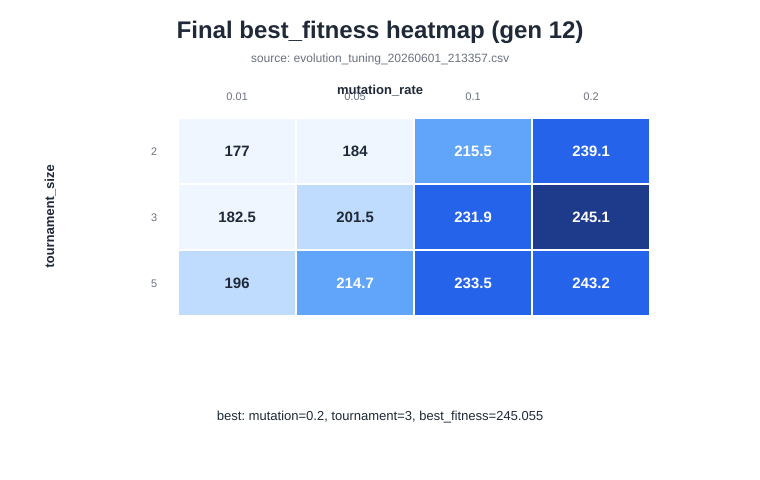
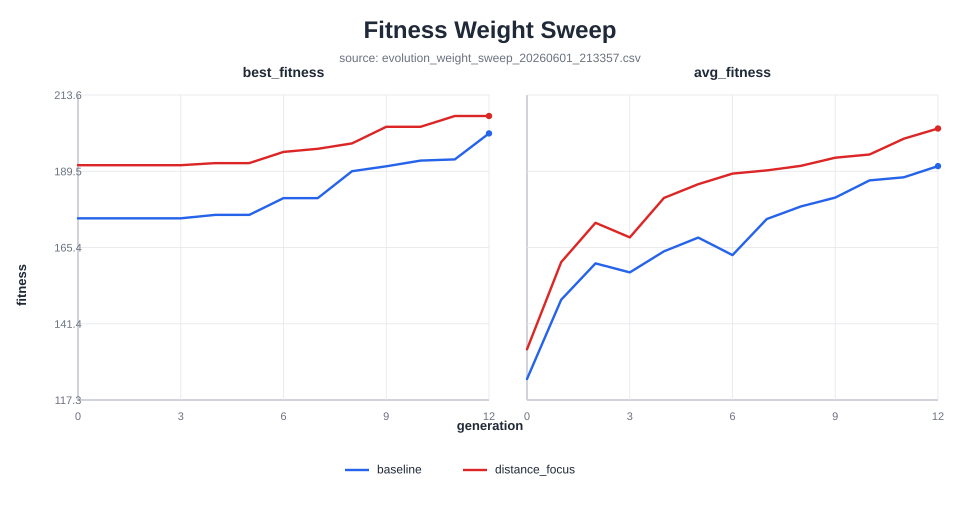

# 進化AIチューニング実験

Issue #99 の受け入れ条件に合わせ、進化AIの小規模な再現性実験を
`evolution/tune_parameters.py` に追加した。
実験グリッドと距離重視weightは `core/constants.py` の
`EVOLUTION_TUNING_*` / `FITNESS_DISTANCE_FOCUS_*` 定数で管理する。

## 実行方法

```bash
python -m evolution.tune_parameters
```

実行すると `docs/experiments/` に以下のCSVを出力する。

* `evolution_tuning_<日時>.csv`
  * `mutation_rate, tournament_size, elite_rate, gen, best_fitness, avg_fitness`
  * `mutation_rate = 0.01, 0.05, 0.10, 0.20`
  * `tournament_size = 2, 3, 5`
  * 各パラメータ組み合わせは同じ `EVOLUTION_TUNING_SEED` から開始する
* `evolution_weight_sweep_<日時>.csv`
  * baseline重みと距離重視重みを同一seedで比較する

## 可視化

最新のCSVからSVGグラフを再生成する。

```bash
python evolution/visualize_experiments.py
```

### パラメータグリッド best_fitness



### 最終世代 best_fitness ヒートマップ



### 適応度重み比較



## 追加実験

複数seed、細かい突然変異率、世代数延長、個体数、エリート率・
トーナメントサイズ、適応度重み、NN層構造、代理入力パターンをまとめて比較する。

```bash
python -m evolution.run_extended_experiments
```

2026-06-01 の追加実験結果は以下に保存した。

* `evolution_extended_experiments_20260601_230733.csv`: 世代ごとの生データ
* `evolution_extended_summary_20260601_230733.csv`: 条件ごとの5 seed平均

## 初期値の根拠

既定値は `mutation_rate=0.05`, `tournament_size=3`,
`elite_rate=0.2` のままとする。突然変異率は高すぎると平均適応度の揺れが大きくなり、
低すぎると探索幅が狭くなるため、授業設計の中間値を初期値に採用する。

適応度重みは現在の `damage=10.0`, `survival=1.0`, `distance=5.0` をbaselineとし、
距離重視ケース `damage=8.0`, `survival=1.0`, `distance=8.0` も測定する。
発表用グラフでは、各CSVの `best_fitness` と `avg_fitness` を世代ごとに比較する。

## 2026-06-01 実行メモ

`evolution_tuning_20260601_213357.csv` では、全パラメータ組み合わせを
同じ `EVOLUTION_TUNING_SEED` から開始した。generation 0 の `best_fitness` と
`avg_fitness` は全組み合わせで一致するため、最終値の差は突然変異率・
トーナメントサイズの影響として比較しやすい。

決定論的な代理fitness上の最終最高値は `mutation_rate=0.20`,
`tournament_size=3` が最も高かった。ただしこれは実ゲームではなく
NN出力を使った小規模ベンチマークなので、初期値は安定寄りの `0.05 / 3` を維持し、
発表・調整時にCSVを見ながら高突然変異率ケースと比較する。
